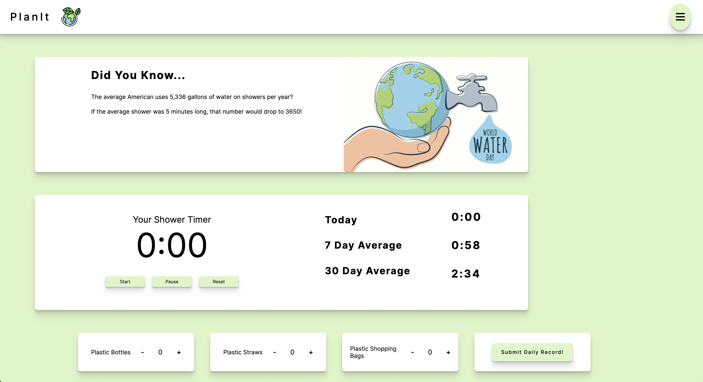

# PlanIt

PlanIt is a web application that encourages users to conserve water by taking a 5 minute shower each day. It features a timer and logs shower times, returning averages over 7 and 30 days. It also includes facts and tips to help users gain insight into their habits.

## Authors

- [@nbalmoori](https://www.github.com/nbalmoori)
- [@whiteheadol](https://www.github.com/whiteheadol)
- [@rachellhill](https://www.github.com/rachellhill)
- [@zwsaile](https://www.github.com/zwsaile)


## Tech Stack

**Client:** React, MaterialUI, and CSS

**Server:** Apollo, GraphQL


## Screenshots




## Run Locally

[Instructions to run locally](./run_locally.md)

## Running Tests

To run tests, run the following command

```bash
  npm run test
```


## Deployment

[PlanIt Deploy Link](https://planit-earth.netlify.app/)

